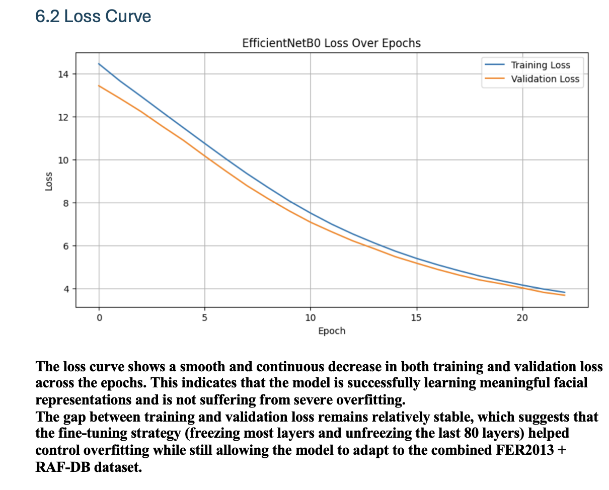
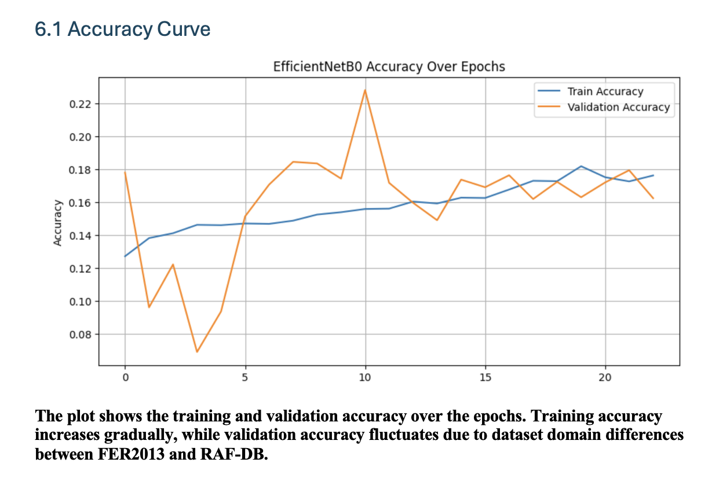
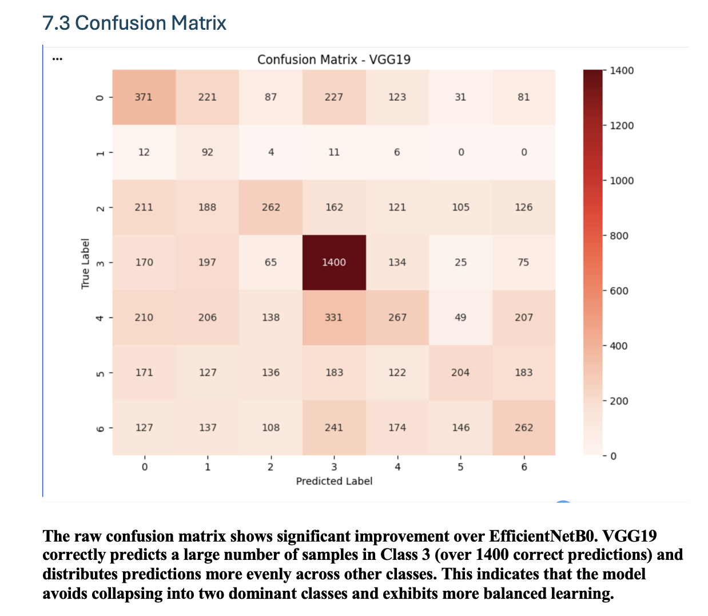

## Deep Learning Models
- EfficientNetB0
- VGG19
- Transfer Learning
- CNN Architecture

## Dataset
- FER2013
- RAF-DB

## Model Features
- Facial emotion classification
- Data augmentation
- Transfer learning
- Fine-tuning
- Accuracy and loss visualization

## Future Improvements
- Improve model accuracy
- Add real-time emotion detection
- Deploy as web application
## Project Outputs

